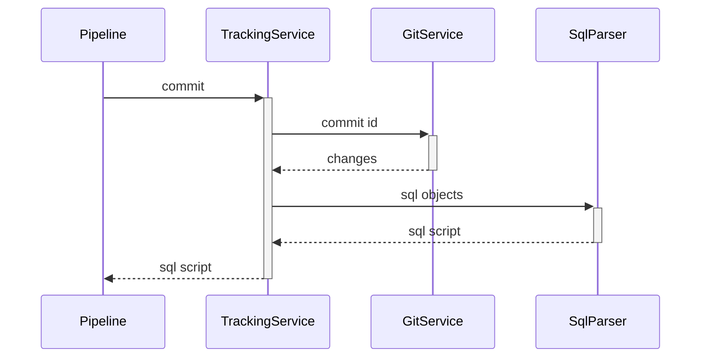
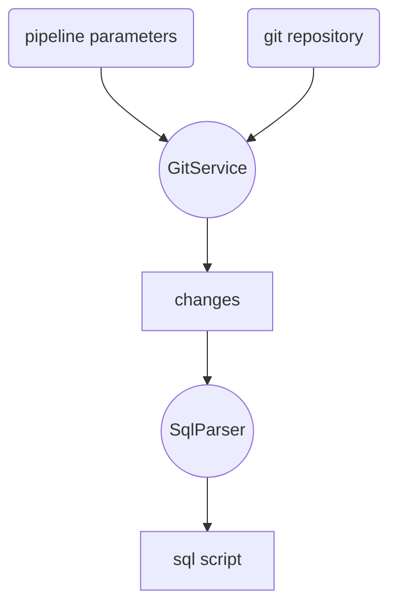

## GitChangeTracker

###### mission
GitChangeTracker is a small console tool for tracking MS SQL code. You can use this tool as a step Azure DevOps pipeline. Tool get sql code from git repository and generate sql script for changed objects.

###### sequence diagram


###### data flow diagram


###### build
```
go build -o GitChangeTracker.exe
```

###### run
```
GitChangeTracker.exe "AzureDevOpsUri" "RepositoryId" "CommitId" "АuthorizationToken" "OutputPath"
```

###### parameters
|name|description|
|-|-|
|AzureDevOpsUri|Azure DevOps server URI|
|RepositoryId|The name or ID of the repository
|CommitId|The id of the commit|
|АuthorizationToken|Azure DevOps server authorization token|
|OutputPath|The path for save sql script|

###### support repository structure
|path|description|
|-|-|
|Programmability\Functions|All sql functions|
|Programmability\Procedures|Procedures|
|Tables|Tables (scripting not supported)|
|Views|Views|
|... |Others code (scripting not supported)
